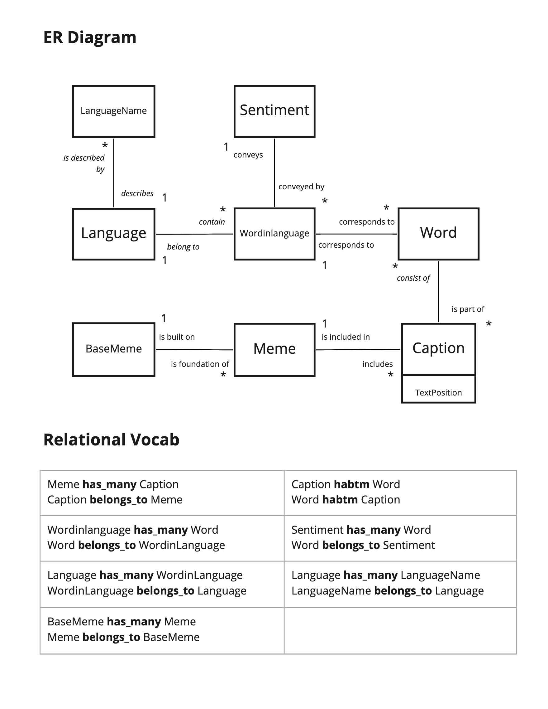

# Meme Generator Data Wrangling and Analysis
Data modeling, data wrangling (database creation), data analysis (language-identification and bootstrap sentiment-analysis), and visualization (via Tableau) of 56,000 Meme Generator memes archived by the Library of Congress. 

## Objective

This repo grew out of graduate project work for Dr. James Howison at the University of Texas at Austin, evolved into visualization project work for Andrea Cato.

Most of this data engineering and wrangling is coded with SQL and Python inside Jupyter Notebooks.  Futher analysis and visualization is done with Tableau. Directories will include datasets and code files. Notebooks include notes and comments walking through different steps of wrangling and analysis.

## Problem Statement

...

## Gallery

[Interact with the dashboard on TableauPublic](https://public.tableau.com/views/MemeGeneratorLanguageandSentiment/FinalDraftDashboard2?:language=en-US&:display_count=n&:origin=viz_share_link)

## Datasources

1. [Library of Congress' Meme Generator dataset](https://www.loc.gov/item/2018655320/) - a dataset created on May 5, 2018, from Library of Congress web crawls of http://memegenerator.net/ and accessioned to the Library's Web Cultures Web Archive. It includes data for 57,652 memes. Meme Generator allows users to create and share image macros (featuring a picture, or artwork, superimposed with text) in the style of popular internet memes. Captions were broken into unigrams. No lemmatization was performed.

2. [Hong Kong University of Science and Technology’s Knowledge Computation Group hate speech dataset](https://github.com/HKUST-KnowComp/MLMA_hate_speech) – contains hate speech indicator words in English, French, and Arabic.

3. [Stonybrook University Data Science Lab's international sentiment lexicons](https://sites.google.com/site/datascienceslab/projects/multilingualsentiment) (also avaiable on [Kaggle](https://www.kaggle.com/rtatman/sentiment-lexicons-for-81-languages)) – sets collected by Yanqing Chen and Steven Skiena ([2014 paper](https://www.semanticscholar.org/paper/Building-Sentiment-Lexicons-for-All-Major-Languages-Chen-Skiena/c5e3b065e352a93d8754b86baaf8ec20bf81a5c3)) of both "positive" and "negative" lexicons for 82 languages.

## Database Design / Data Modeling

## Challenges and adaptations

**Identifying Languages - true and false cognates :**

When comparing the individual words in each meme to words in our 82 lexicons (in order to assign a words_in_language_id) we quickly realized the problem of both true and false cognates. Words in memes were being assinged to the first matching word in a sentiment lexicon regardless of meme language. 
- e.g. the netural english ("a"), spanish ("las" and "los"), and french ("un") articles were included in other language sentiment lexicons.
- even the neutral english verb "is" in a clearly English meme was assigned a negative sentiment score in a separate  lexicon) 

Accordingly memes were often assigned two (2) or more different languages, which further complicated our ability to determine language and sentiments. 

Multilingual memes are certainly a reality, and this processing method is certianly not an effective approach to take. So we bracketed this issue and turned to several a Python package that would first probabilistically identify the language of our captions, allowing us to compare and match caption words to the sentiment lexicons of those identified languages. This strategy  allowed us to get around the fact that these sentiment lexicons were not created to  identify languages, but rather to analyze datasets of *known* languages.
- I firt tried the *langdetect* package, but a rough visual check on a sample set of meme captions showed an unreasonable amount of misidentification.
- I then turned to the *langid* package, which visibly performed better (but certainly not perfect) on a sample set of captions. 

